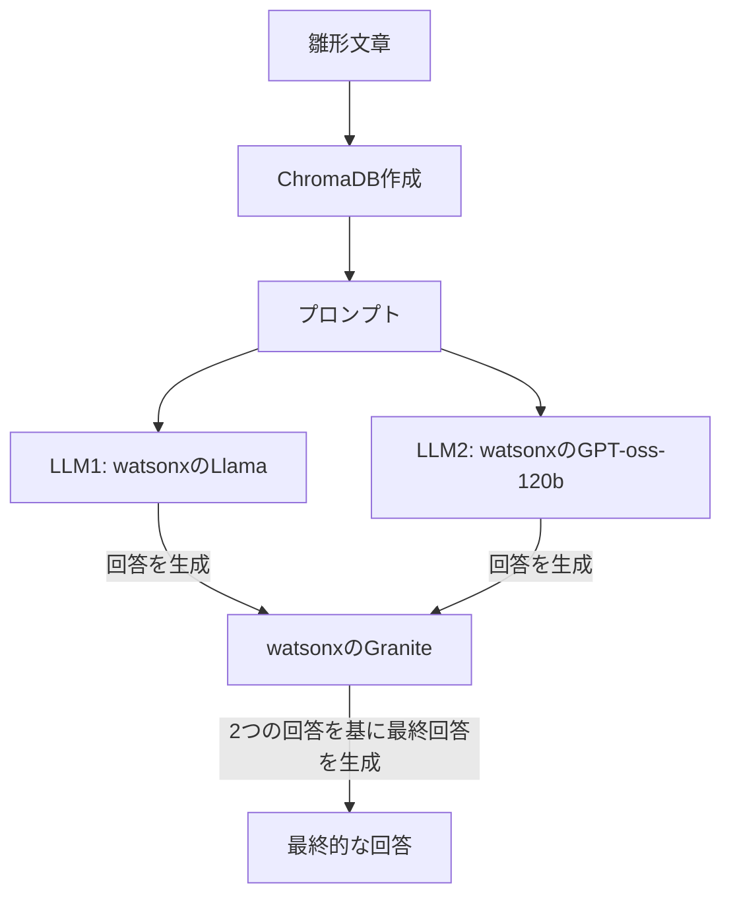

# プロジェクト概要

このプロジェクトは **IBM watsonx** を用いた Llama および GPT モデルを活用し，  
**Gradio** 上でブラウザから対話できるチャットアプリケーションです。  
また，PDFドキュメントを読み込み，その内容を元にした質問応答（RAG: Retrieval-Augmented Generation）を行うことができます。

---
## 主な特徴
- 同一質問を2モデルに同時投げて回答を比較
- PDF（日本語対応）を知識ベースとして利用
- ベクトル検索＋BM25検索のハイブリッド検索
- Gradioによる直感的なUI（質問入力欄＋2つの回答欄）
- 質問例サンプル付き


## セットアップ手順

### 1. 必要フォルダの作成
```bash
mkdir docs/   # PDFファイルを格納するフォルダ
```
docs/ フォルダ内に，利用したい PDF（例: housetomato.pdf）を保存してください。

### 2. 必要なパッケージのインストール

以下を直接インストールするか，requirements.txt を利用します。

```
pip install fqdn getpass4 greenlet isoduration jsonpointer jupyterlab llama-index-embeddings-huggingface llama-index-llms-ibm llama-index-readers-file llama-index-retrievers-bm25 PyMuPDF tinycss2 uri -template webcolors sentencepiece
pip install ibm_watsonx_ai

```
また，requirements.txt に書かれたパッケージをまとめてインストール
```
pip install -r requirements.txt
```

### 3. 実行方法
```
python chat.py
```

## アーキテクチャ


